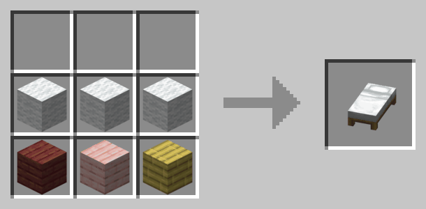

# Crafting GIF

A tool to create a GIF of a Minecraft crafting recipe.

## Examples

### [`examples/bed.toml`](./examples/bed.toml)

### [`examples/barrel.toml`](./examples/barrel.toml)

### [`examples/barrel.toml`](./examples/barrel.toml) (with `--dark`)

## Development

The textures will need to be generated by
<https://github.com/jasger9000/TextureExportMod>.  Using the mod, export
the textures as 256x256 and then use `resize.sh` to convert them into
80x80.
